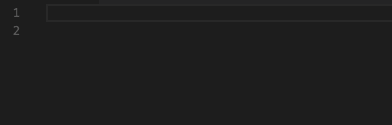

# TypeDoc VSCode Extension
Static type checking for pure JavaScript

## Features

TypeDoc type warnings in your code.



## Release Notes

### 0.0.20

- Update type-doc version

### 0.0.19

- Better support for dot notation handling
- Various small bug fixes

### 0.0.14

- Support for external type definition files in `.d.ts` format. Access through the settings:
```
{
  "typeDocServer.definitionFiles": [
    "./src/integrationTests/test.d.ts"
  ]
}
```
- Added in TypeScript's lib.d.ts for better definitions. Included with every install.

### 0.0.10

- Support for super/sub classes, either inferring, i.e.
```
class SuperClass {}
class SubClass extends SuperClass {}
const someClass /* t:SuperClass */ = new SubClass();
```
or by explicit comment
```
/**
 * class :: SuperClass
 */
class SuperClass {}
/**
 * class :: SubClass => SuperClass
 */
class SubClass extends SuperClass {}
const someClass /* t:SuperClass */ = new SubClass();
```
- `Object` is now an alias for `any`

### 0.0.7

Better support for inline functions, e.g.

```
somePromise.then(function(result) {
  return result;
});
```

### 0.0.6

Update version and bump TypeDoc. Now should properly handle promises and type inference.

### 0.0.3

Update version and bump TypeDoc

### 0.0.1

Initial release of TypeDoc VSCode
